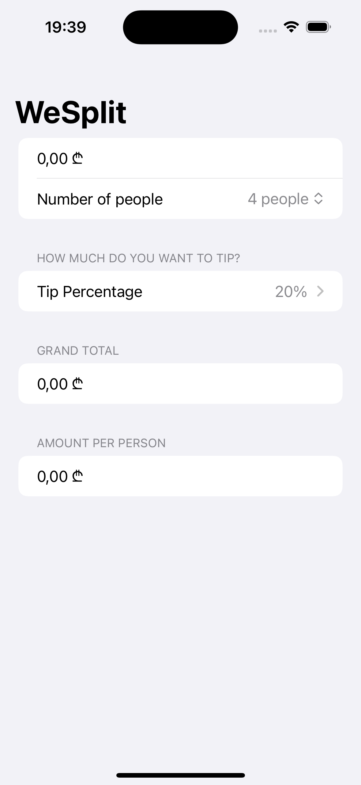
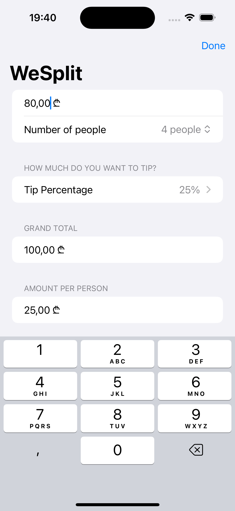

# Project 01 - WeSplit

WeSplit is an intuitive iOS application designed to make splitting bills a breeze. Whether you’re dining out with friends or sharing expenses, WeSplit ensures everyone pays their fair share. The app allows users to input the total check amount, the number of people sharing the bill, and the desired tip percentage. It then calculates the amount each person needs to pay, including their portion of the tip. With its simple and user-friendly interface, WeSplit takes the hassle out of group payments, making it easy to manage shared expenses quickly and accurately.

## Features

- Input total check amount
- Specify the number of people sharing the bill
- Select the tip percentage
- Calculate the amount each person needs to pay

## How to Use

1. Enter the total check amount.
2. Input the number of persons.
3. Choose the tip percentage.
4. View the calculated payment per person.

### Topics: 

- Form 
- NavigationStack  
- @State  
- Picker

## Screenshots

  
  

